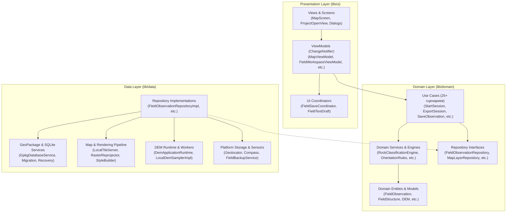
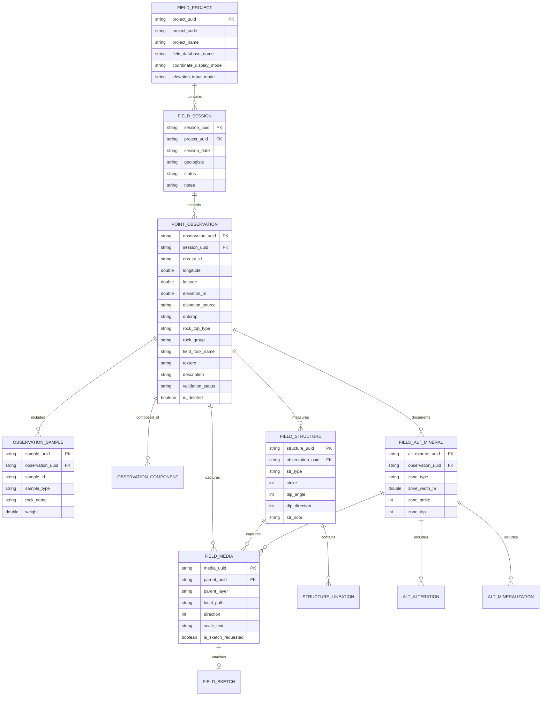

# FieldScan — Дизайн, архитектура и функциональная спецификация системы

Документ описывает назначение, архитектурную организацию, устройство пользовательского интерфейса, модель данных и полный функционал мобильного рабочего места полевого геолога **FieldScan** (версия 1.0.4+).

---

## 1. Общие сведения и концепция продукта

### 1.1. Назначение
**FieldScan** — специализированное автономное программное обеспечение для полевых геологов, поисковых отрядов и геологоразведочных компаний. Приложение объединяет картографическую основу (растровые и векторные геологические карты, космоснимки, изолинии, сложную символику), полевой электронный журнал (точки наблюдения, литологические описания, учёт образцов, замеры элементов залегания структур, зоны изменений и рудной минерализации), геопривязанную фотодокументацию и средства навигации в единую локальную базу геоданных на базе открытого стандарта **OGC GeoPackage**.

```
┌──────────────────────────────────────────────────────────────────────────────┐
│                             ОФИС (Камеральный этап)                          │
│  Подготовка проекта в ArcGIS Pro / FieldScanTools ──> Выгрузка GeoPackage    │
└──────────────────────────────────────┬───────────────────────────────────────┘
                                       │ .gpkg (картооснова, стили, словари)
                                       ▼
┌──────────────────────────────────────────────────────────────────────────────┐
│                              ПОЛЕ (Автономный этап)                          │
│                                                                              │
│  ┌─────────────────────────┐   ┌────────────────────────┐   ┌─────────────┐  │
│  │   ОФЛАЙН-КАРТА          │   │  ПОЛЕВОЙ ЖУРНАЛ        │   │  НАВИГАЦИЯ  │  │
│  │   MapLibre GL           │   │  Наблюдения & образцы  │   │  GPS / GNSS │  │
│  │   Растровые пирамиды    │───│  Структуры & залегание │───│  Компас     │  │
│  │   Векторные слои        │   │  Альтерация & руда     │   │  DEM высоты │  │
│  │   Символика & подписи   │   │  Фотографии & скетчи   │   │  Сетка/меры │  │
│  └─────────────────────────┘   └────────────────────────┘   └─────────────┘  │
│                                      │                                       │
│              Локальное автосохранение, транзакции, теневые копии             │
└──────────────────────────────────────┬───────────────────────────────────────┘
                                       │ Экспорт (ZIP + Excel + Media + Отчёт)
                                       ▼
┌──────────────────────────────────────────────────────────────────────────────┐
│                             ОФИС (Камеральный этап)                          │
│    Импорт в корпоративную ГИС, контроль качества по validation_report.json    │
└──────────────────────────────────────────────────────────────────────────────┘
```

### 1.2. Ключевые принципы
1. **100% автономность (Offline-First):** приложение полностью функционирует без подключения к интернету и внешним серверам. Все слои карт, классификаторы, высотные модели и журналы находятся на физическом накопителе устройства.
2. **Открытый стандарт OGC GeoPackage:** в качестве платформы данных используется контейнер SQLite 3 со стандартными таблицами геометрий и тайлов OGC, дополненный таблицами реляционной модели FieldScan. Исключается лицензионная зависимость от проприетарных мобильных SDK (ArcGIS Maps SDK/Runtime).
3. **Строгая связность полевых сущностей:** данные не фрагментируются. Каждая фотография, скетч, замер трещины или отобранный скол жестко привязаны к точке наблюдения ([`FieldObservation`](file:///C:/Codex/Fieldscan_codex/fieldscan_app/lib/domain/models/field_observation.dart)), рабочей сессии ([`FieldSession`](file:///C:/Codex/Fieldscan_codex/fieldscan_app/lib/domain/models/field_session.dart)) и проекту ([`FieldProject`](file:///C:/Codex/Fieldscan_codex/fieldscan_app/lib/domain/models/field_project.dart)).
4. **Непрерывность работы и защита от сбоев (Resilience):** автоматическое сохранение по таймеру и событиям, фоновая запись теневых копий каждые 5 минут, мягкое удаление записей с корзиной (Trash/Undo), сохранение несохранённых текстов при крашах ([`FieldTextDraft`](file:///C:/Codex/Fieldscan_codex/fieldscan_app/lib/ui/core/services/field_text_draft.dart)) и накопитель потерянных фото ([`PendingPhotoStore`](file:///C:/Codex/Fieldscan_codex/fieldscan_app/lib/data/services/platform/pending_photo_store.dart)).
5. **Экспертная геологическая валидация:** встроенные правила классификации магматических, осадочных и метаморфических пород ([`RockClassificationEngine`](file:///C:/Codex/Fieldscan_codex/fieldscan_app/lib/domain/services/rock_classification_engine.dart)), контроль правила правой руки (RHR) для азимутов залегания ([`FieldOrientationRules`](file:///C:/Codex/Fieldscan_codex/fieldscan_app/lib/domain/services/field_orientation_rules.dart)) и нормализация гранулометрии ([`FieldGrainSizeRules`](file:///C:/Codex/Fieldscan_codex/fieldscan_app/lib/domain/services/field_grain_size_rules.dart)).
6. **Многоязычность:** поддержка русского, английского и арабского (RTL) интерфейсов ([`AppLocalizations`](file:///C:/Codex/Fieldscan_codex/fieldscan_app/lib/l10n/generated/app_localizations.dart)).

---

## 2. Архитектура программной системы

Приложение спроектировано по принципам **Clean Architecture** с разделением ответственности на Presentation, Domain и Data слои, использованием паттерна **MVVM** (Model-View-ViewModel) и реактивным внедрением зависимостей через **Provider**.



### 2.1. Уровень приложения и инициализация (App Bootstrap)
- Точка входа: [`main.dart`](file:///C:/Codex/Fieldscan_codex/fieldscan_app/lib/main.dart).
- Дерево компонентов конфигурируется в [`FieldScanApp`](file:///C:/Codex/Fieldscan_codex/fieldscan_app/lib/app/fieldscan_app.dart).
- Внедрение зависимостей реализовано через [`DependencyScope`](file:///C:/Codex/Fieldscan_codex/fieldscan_app/lib/app/dependency_scope.dart), создающий экземпляры низкоуровневых сервисов, репозиториев и сценариев использования.
- Жизненный цикл приложения отслеживается виджетом `_CompassMapLifecycle`, который приостанавливает датчики ориентации в фоне и инициирует автоматическое сбрасывание буферов сохранения ([`FieldSaveCoordinator.flushAll()`](file:///C:/Codex/Fieldscan_codex/fieldscan_app/lib/ui/core/services/field_save_coordinator.dart)) с запуском контрольных точек проекта ([`FieldBackupService.scheduleCheckpoint()`](file:///C:/Codex/Fieldscan_codex/fieldscan_app/lib/data/services/platform/field_backup_service.dart)).

### 2.2. Картографический движок и контур рендеринга
Рендеринг карт выполняется плагином **MapLibre GL** с двумя контурами:
1. **Статический контур:** [`MapLibreStyleBuilder`](file:///C:/Codex/Fieldscan_codex/fieldscan_app/lib/data/services/map/maplibre_style_builder.dart) формирует базовый стиль MapLibre Style JSON с якорными слоями порядка отрисовки (`raster-overlay-anchor`, `feature-overlay-anchor`).
2. **Динамический контур:**
   - **Встроенный HTTP Loopback сервер:** [`LocalTileServer`](file:///C:/Codex/Fieldscan_codex/fieldscan_app/lib/data/services/map/local_tile_server.dart) слушает локальный интерфейс (`127.0.0.1:port`) и обслуживает запросы к тайлам растров, векторных слоев, полигонов и шрифтовых глифов (`/projects/{session}/raster/...`, `/features/...`, `/glyphs/...`).
   - **Растровый конвейер:** [`RasterTileProvider`](file:///C:/Codex/Fieldscan_codex/fieldscan_app/lib/data/services/map/raster_tile_provider.dart) использует постоянный фоновый worker isolate с изолированным подключением к SQLite. [`RasterReprojector`](file:///C:/Codex/Fieldscan_codex/fieldscan_app/lib/data/services/map/raster_reprojector.dart) выполняет билинейную интерполяцию или выборку по ближайшему соседу при несовпадении проекций (Web Mercator, UTM, географические CRS KSA-GRF17 / WGS 84). Оборудован двухуровневым кэшем (память 48 МБ + диск 512 МБ).
   - **Контроллеры слоев:** [`RasterLayerController`](file:///C:/Codex/Fieldscan_codex/fieldscan_app/lib/ui/features/map/raster_layer_controller.dart) и [`VectorTileLayerController`](file:///C:/Codex/Fieldscan_codex/fieldscan_app/lib/ui/features/map/vector_tile_layer_controller.dart) динамически монтируют слои, регулируют непрозрачность (opacity) и видимость без перезагрузки карты.
   - **Сложная символика и аннотации:** импортированные из ArcGIS векторные стили упаковываются в структуру MapLibre Expressions через [`LayerPaintBuilder`](file:///C:/Codex/Fieldscan_codex/fieldscan_app/lib/data/services/map/layer_paint_builder.dart); надписи и геологические знаки отображаются с использованием атласа глифов [`MapGlyphAssets`](file:///C:/Codex/Fieldscan_codex/fieldscan_app/lib/data/services/map/map_glyph_assets.dart).

### 2.3. Высотная модель (DEM Runtime)
- Архитектура DEM изолирована в пакете [`lib/data/services/dem/`](file:///C:/Codex/Fieldscan_codex/fieldscan_app/lib/data/services/dem/).
- Поддерживает работу с форматом Cloud-Optimized GeoTIFF (COG) в системе высот EGM2008:
  - **Copernicus DEM GLO-30** (глобальное разрешение 30 метров).
  - **GEDTM30** (v1.2).
- [`DemDownloadCoordinator`](file:///C:/Codex/Fieldscan_codex/fieldscan_app/lib/data/services/dem/dem_download_coordinator.dart) обеспечивает докачивание тайлов фрагментами по HTTP Range запросам с возможностью паузы и возобновления.
- [`LocalDemSamplerImpl`](file:///C:/Codex/Fieldscan_codex/fieldscan_app/lib/data/services/dem/local_dem_sampler_impl.dart) выполняет офлайн-выборку и билинейную интерполяцию абсолютной высоты для любой точки карты с субсекундной задержкой.
- Поддерживается резервный расчет отметок по слою изолиний ([`ContourElevationInterpolator`](file:///C:/Codex/Fieldscan_codex/fieldscan_app/lib/domain/services/contour_elevation_interpolator.dart)) и прямое чтение барометрической/спутниковой высоты с GNSS-приемника.

---

## 3. Архитектура и дизайн пользовательского интерфейса (UI/UX)

Интерфейс спроектирован по принципу **Landscape-First** (ландшафтная ориентация для планшетов от 10 дюймов, базовое разрешение тестирования 2000×1200, Lenovo Tab). Элементы управления оптимизированы для полевых условий: крупные интерактивные зоны (hit target не менее 48×48 dp), высокая контрастность для работы под прямым солнцем, быстрый доступ к действиям фиксации данных одним тапом.

### 3.1. Анатомия главного рабочего экрана карты ([`MapScreen`](file:///C:/Codex/Fieldscan_codex/fieldscan_app/lib/ui/features/map/map_screen.dart))

```
┌────────────────────────────────────────────────────────────────────────────────────────┐
│ [📁] [🛡️] [+] [-] [⛶] [🧭] [▦ Сетка 0.05°] [📏 Линейка] [ℹ️ Инфо] [▶ Сессия #1] [⚙️]  │ ◄── MapToolbar
├────────────────────────────────────────────────────────────────────────────────────────┤
│ 💼 Проект: PRJ-2026 · Участок Северный | 👤 Иванов А.И. | [Завершить] [📖] [💾] [⛰️ DEM]│ ◄── FieldWorkspaceBar
├───────────────────────────────────────────────────────────────┬────────────────────────┤
│                                                               │ СЛОИ КАРТЫ        [✕]  │
│  [🧭 КОМПАС]           [ 📍 Точка ] [ 📐 Стр ] [ ✨ Мин ] [📖] │ ────────────────────── │
│   Аз: 042° (ИСТ)                                              │ [Все] [Пол] [Лин] [Тчк]│
│   GPS: ±2.4 м          ┌───────────────────────────┐          │ ☑ 📂 Геология 1:50 000 │
│                        │             ┼             │          │   ☑ Разрывные нарушения│
│                        │     (Крест фиксации)      │          │   ☑ Дайки диабазов     │
│                        └───────────────────────────┘          │   ☑ Горизонты известняк│
│                                                               │ ☑ 📂 Маршруты KML/KMZ  │
│                                                               │ ☑ 🗺️ Космоснимок (Растр│
│                                                               │ ────────────────────── │
│ [ 0 ── 250 м ]                                                │ Непрозрачность: 85% ── │
├───────────────────────────────────────────────────────────────┴────────────────────────┤
│ Координаты: 24°15'32.4"N 45°21'08.2"E | Масштаб: z14.5 | GPS: 24.2590, 45.3523 (±2.4м)│ ◄── MapStatusBar
└────────────────────────────────────────────────────────────────────────────────────────┘
```

#### Ключевые компоненты экрана:
1. **Верхний тулбар ([`MapToolbar`](file:///C:/Codex/Fieldscan_codex/fieldscan_app/lib/ui/features/map/widgets/map_toolbar.dart)):**
   - Кнопка смены проекта ([`IconToolButton`](file:///C:/Codex/Fieldscan_codex/fieldscan_app/lib/ui/core/widgets/icon_tool_button.dart) `Icons.folder_open`).
   - Кнопка статуса сохранения и восстановления с динамическим бейджем `_SaveStatusBadge` (зеленый = сохранено, синий спиннер = идет транзакция, красный = ошибка с возможностью перехода в центр восстановления).
   - Инструменты зума (`ZoomIn`, `ZoomOut`, `FitExtent`).
   - Переключатель отображения плавающей панели компаса.
   - Тумблер координатной сетки с текстовым полем шага сетки в градусах (WGS 84).
   - Инструмент интерактивного измерения расстояний (линейка с промежуточными метками на сегментах).
   - Режим идентификации объектов карты (Identify).
   - Тумблер разворачивания панели полевой сессии.
   - Переход в глобальные настройки проекта.

2. **Панель рабочей сессии ([`FieldWorkspaceBar`](file:///C:/Codex/Fieldscan_codex/fieldscan_app/lib/ui/features/field_workspace/views/field_workspace_bar.dart)):**
   - Отображает код и название проекта, текущего геолога и статус сессии.
   - Управление сессией: «Начать сессию», «Изменить сессию», «Завершить сессию».
   - Кнопка быстрого доступа к геологическим справочникам (Dictionaries).
   - Кнопка пакетного экспорта полевых данных в ZIP/Excel.
   - История сессий проекта с количеством точек.
   - Кнопка вызова менеджера рельефа и локальных моделей высот DEM.

3. **Центральная рабочая область (`_MapWorkspace`):**
   - **Плавающий тулбар размещения ([`FieldMapToolbar`](file:///C:/Codex/Fieldscan_codex/fieldscan_app/lib/ui/features/field_map/widgets/field_map_toolbar.dart)):** размещен сверху по центру, содержит кнопки быстрого создания объектов:
     - `📍 Точка наблюдения` ([`FieldMapLayer.pointObservation`](file:///C:/Codex/Fieldscan_codex/fieldscan_app/lib/domain/models/field_map.dart))
     - `📐 Структура` ([`FieldMapLayer.structures`](file:///C:/Codex/Fieldscan_codex/fieldscan_app/lib/domain/models/field_map.dart))
     - `✨ Альтерация / минерализация` ([`FieldMapLayer.altMineral`](file:///C:/Codex/Fieldscan_codex/fieldscan_app/lib/domain/models/field_map.dart))
     - Кнопка просмотра списка последних созданных записей (`FieldRecordsPickerDialog`).
     - Кнопка настройки символики и стилей отображения слоев (`FieldMapStyleDialog`).
   - **Оверлей позиционирования (`FieldMapPlacementOverlay`):** появляется при активации любого из трех режимов создания. Показывает фиксированный визирный крест в центре экрана, текущие координаты под перекрестием в выбранном формате (DD или DMS), кнопку центрирования на текущую GNSS-позицию геолога («Переместить к GPS») и кнопки подтверждения («Подтвердить точку») и отмены.
   - **Панель навигации и компаса ([`CompassPanel`](file:///C:/Codex/Fieldscan_codex/fieldscan_app/lib/ui/features/compass/views/compass_panel.dart)):** плавающая карточка слева вверху. Включает вращающуюся картушку компаса ([`CompassRose`](file:///C:/Codex/Fieldscan_codex/fieldscan_app/lib/ui/features/compass/widgets/compass_rose.dart)), цифровой азимут направления взгляда/планшета, статус качества магнитного датчика ([`HeadingQualityBadge`](file:///C:/Codex/Fieldscan_codex/fieldscan_app/lib/ui/features/compass/widgets/heading_quality_badge.dart)), индикатор точности GPS (в метрах) и статус калибровки.
   - **Маркер геолога и конус обзора:** динамические векторные оверлеи ([`UserHeadingMarker`](file:///C:/Codex/Fieldscan_codex/fieldscan_app/lib/ui/features/map/widgets/user_heading_marker.dart) и [`HeadingConeLayer`](file:///C:/Codex/Fieldscan_codex/fieldscan_app/lib/ui/features/map/widgets/heading_cone_layer.dart)), отображающие текущее положение исследователя и направление взгляда в реальном времени.
   - **Динамическая масштабная линейка ([`MapScaleBar`](file:///C:/Codex/Fieldscan_codex/fieldscan_app/lib/ui/features/map/widgets/map_scale_bar.dart)):** автоматический расчет масштаба в метрах и километрах в зависимости от широты и уровня зума.
   - **Информационная панель атрибутов ([`IdentifyPanel`](file:///C:/Codex/Fieldscan_codex/fieldscan_app/lib/ui/features/map/widgets/identify_panel.dart)):** выдвигается справа снизу при клике на любой векторный объект карты, отображает список совпавших слоев и полную таблицу атрибутов выбранного объекта.

4. **Правая боковая панель слоев ([`LayerPanelDrawer`](file:///C:/Codex/Fieldscan_codex/fieldscan_app/lib/ui/features/layers/layer_panel_drawer.dart)):**
   - Выдвижная панель фиксированной ширины (320-360 dp) с анимацией сворачивания.
   - Панель фильтрации слоев по типам геометрии ([`LayerTypeFilterBar`](file:///C:/Codex/Fieldscan_codex/fieldscan_app/lib/ui/features/layers/layer_type_filter_bar.dart)): Все, Полигоны, Линии, Точки, Текстовые аннотации.
   - Группа файлов импорта KML/KMZ с пакетным переключением видимости треков и путевых точек.
   - Иерархическое дерево групп слоев карты с чекбоксами видимости.
   - Элемент каждого слоя ([`LayerRow`](file:///C:/Codex/Fieldscan_codex/fieldscan_app/lib/ui/features/layers/layer_row.dart)) содержит:
     - Чекбокс включения/выключения слоя.
     - Иконку типа геометрии.
     - Наименование слоя и счетчик объектов.
     - Кнопку просмотра условных знаков и легенды ([`CartographicLegendDialog`](file:///C:/Codex/Fieldscan_codex/fieldscan_app/lib/ui/features/layers/cartographic_legend_dialog.dart)).
     - Ползунок прозрачности слоя ([`LayerOpacitySlider`](file:///C:/Codex/Fieldscan_codex/fieldscan_app/lib/ui/features/layers/layer_opacity_slider.dart)).

5. **Нижняя статусная панель ([`MapStatusBar`](file:///C:/Codex/Fieldscan_codex/fieldscan_app/lib/ui/features/map/widgets/map_status_bar.dart)):**
   - Текущие координаты визира карты (десятичные градусы DD либо градусы, минуты, секунды DMS).
   - Точный уровень зума карты.
   - Актуальные координаты геолога по GPS и погрешность фиксации в метрах.
   - Индикация блокировок и предупреждений.

---

### 3.2. Экран открытия проектов и импорта ([`ProjectOpenView`](file:///C:/Codex/Fieldscan_codex/fieldscan_app/lib/ui/features/project_open/project_open_view.dart))
Стартовый экран при запуске или смене рабочей базы:
- **Список «Мои проекты»:** список ранее открывавшихся рабочих областей GeoPackage с датами изменения, путями к файлам и индикатором активного проекта.
- **Кнопка «Открыть .gpkg»:** системный файловый диалог для выбора и валидации нового файла проекта. Проверяет наличие обязательных таблиц OGC (`gpkg_contents`, `gpkg_spatial_ref_sys`) и выполняет инициализацию структур FieldScan.
- **Секция KML/KMZ импорта:** позволяет импортировать внешние маршрутные треки, границы участков и опорные точки из файлов Google Earth (KML/KMZ), преобразуя их в слои проекта с сохранением названий и стилей линий.
- **Смена языка:** диалог [`AppLanguageDialog`](file:///C:/Codex/Fieldscan_codex/fieldscan_app/lib/ui/features/settings/app_language_dialog.dart) для переключения между русским, английским и арабским языками с мгновенной локализацией интерфейса.

---

### 3.3. Специализированные геологические редакторы и диалоги

#### 3.3.1. Редактор точки наблюдения ([`FieldObservationEditorDialog`](file:///C:/Codex/Fieldscan_codex/fieldscan_app/lib/ui/features/field_observation/views/field_observation_editor_dialog.dart))
Полноэкранная карточка описания полевого обнажения/точки:
- **Заголовок:** полевой номер точки (`ObsPtID`), локальный порядковый номер, дата/время фиксации, фамилии геологов. Доступно безопасное каскадное переименование номера точки с обновлением всех дочерних образцов, структур и медиа.
- **Географическое положение и высота:**
  - Координаты WGS 84 с возможностью форматирования.
  - Интерактивный высотный чип ([`FieldElevationChip`](file:///C:/Codex/Fieldscan_codex/fieldscan_app/lib/ui/features/field_observation/views/field_elevation_chip.dart)): отображает отметку высоты в метрах, источник высоты (Локальная DEM, Изолинии рельефа, GNSS, Ручной ввод) и статус контроля качества (QC Status). При клике открывает диалог ручной корректировки или просмотра источника.
- **Характеристики обнажения и петрография:**
  - Тип обнажения (коренное, делювий, элювий, высыпки, карьер и др.) через строгий или расширяемый словарь.
  - Цвет породы (свежий скол и поверхность выветривания).
  - Размер зерен (гранулометрия) с валидацией допустимости для выбранного генетического класса пород.
  - Текстура и структура породы.
- **Классификация породы (Rock Classification Engine):**
  - Верхний генетический тип: Магматические интрузивные, Магматические эффузивные, Осадочные, Метаморфические.
  - Группа пород, подкласс и уточняющие характеристики.
  - Мета-префикс (орто-, пара-, мета-).
  - **Автоматический подбор названия породы:** на основе введенного минерального состава и долей темноцветных (мафических) минералов движок предлагает канонические названия пород и выдает предупреждения о несовместимости минералов (например, кварц + оливин в магматитах).
- **Стратиграфическая и тектоническая привязка:**
  - Свита, толща, пачка, пласт, литодема, комплекс, тектонический пояс.
  - Палеонтологические остатки: тип фоссилий и описание фауны/флоры.
- **Компоненты породы (`ObservationRockComponent`):** табличная секция добавления минералов с указанием процентного содержания, роли (главный, породообразующий, акцессорный, вторичный) и признака мафичности.
- **Учёт отобранных образцов (`ObservationSample`):**
  - Номер образца (автоматическая генерация по шаблону `{ObsPtID}-S1`, `{ObsPtID}-S2`).
  - Тип образца (штуф, скол, борозда, геохимическая проба, шлам).
  - Название породы образца, гранулометрия, степень выветрелости, физическое состояние (связный/рыхлый), масса в граммах/кг и примечание.
- **Встроенная медиа-галерея:** отображение миниатюр привязанных к этой точке фотографий и скетчей, кнопка мгновенного вызова системной камеры.

#### 3.3.2. Редактор геологических структур ([`FieldStructureEditorDialog`](file:///C:/Codex/Fieldscan_codex/fieldscan_app/lib/ui/features/field_structure/views/field_structure_editor_dialog.dart))
Карточка фиксации пространственного положения геологических тел и тектонических нарушений:
- **Привязка к точке:** выбор родительской точки наблюдения (`ObsPtID`).
- **Тип структуры:** напластование/слоистость, сланцеватость, кливаж, гнейсовидность, трещина отдельностей, тектонический разлом, сдвиг, зеркало скольжения, контакт интрузии, дайка, жила.
- **Элементы залегания плоскости:**
  - Азимут простирания (Strike): 0–360°.
  - Угол падения (Dip Angle): 0–90°.
  - Азимут падения (Dip Direction): 0–360°.
  - **Контроль геометрии:** автоматическая валидация правила правой руки (Right Hand Rule — RHR), согласование азимута падения и простирания (разница строго 90°), подсветка ошибок и предупреждений.
- **Линейные структуры (Lineations):**
  - Тип линейности (штрихи скольжения, минеральная ориентировка, шарнир складки, пересечение кливажа).
  - Азимут погружения (Plunge Direction) и угол погружения (Plunge Angle).
  - Кинематика/направление смещения (сброс, взброс, левый/правый сдвиг).
- **Генератор геологического описания:** кнопка автоматической сборки связного текстового описания ориентировки для отчёта.
- Прикрепление фотоснимков структуры с замерами компаса.

#### 3.3.3. Редактор альтерации и минерализации ([`FieldAltMineralEditorDialog`](file:///C:/Codex/Fieldscan_codex/fieldscan_app/lib/ui/features/field_alt_mineral/views/field_alt_mineral_editor_dialog.dart))
Документирование метасоматических изменений и рудных проявлений:
- **Характеристики рудной / измененной зоны:** тип зоны (штокверк, жильная зона, березит, грейзен, скарн, зона дробления/окварцевания), видимая мощность в метрах, элементы залегания контактов зоны (простирание, падение, азимут).
- **Околожильные изменения (`FieldAlteration`):**
  - Тип гидротермального изменения (окварцевание, серицитизация, хлоритизация, пропилитизация, каолинизация, аргиллизация, ожелезнение и др.).
  - Интенсивность проявления (слабая, умеренная, сильная, нацело замещенная).
  - Форма выделения (сплошная, пятнистая, прожилковая, каёмчатая).
- **Минерализация (`FieldMineralization`):**
  - Рудный минерал (пирит, халькопирит, галенит, сфалерит, магнетит, золото видимое и др.).
  - Морфология (вкрапленность, гнезда, массивные агрегаты, дендриты, друзы).
  - Размеры рудных агрегатов и зерен.
  - Ориентировка рудных прожилков (простирание, падение).
  - Процентное обилие / содержание визуально.
  - Жильные минералы (кварц, кальцит, барит, флюорит).
- Привязанные детальные макрофотографии руды.

#### 3.3.4. Диалог медиафиксации ([`FieldMediaDialog`](file:///C:/Codex/Fieldscan_codex/fieldscan_app/lib/ui/features/field_media/views/field_media_dialog.dart))
- Съёмка фото с камеры планшета или выбор готового изображения.
- Автоматическое считывание навигационных параметров в момент спуска затвора: координаты WGS 84, барометрическая/GNSS высота, горизонтальная погрешность, азимут направления съемки по компасу.
- Ввод масштаба объекта (например: «молоток 35 см», «монета 2 см», «керн 60 мм»).
- Выбор шаблона геологической заметки с подстановкой атрибутов родительского объекта (`{F_RockName}`, `{Texture}`, `{StrType}`).
- **Полевые скетчи и зарисовки:** чекбокс «Требуется скетч» (`isSketchRequested`), прикрепление графического файла отрисованной схемы обнажения с контролем статуса готовности для офиса (`pending`, `drawn`, `exported`).

#### 3.3.5. Менеджер геологических словарей ([`FieldDictionaryManagerDialog`](file:///C:/Codex/Fieldscan_codex/fieldscan_app/lib/ui/features/field_dictionary/views/field_dictionary_manager_dialog.dart))
Управление едиными классификаторами проекта:
- Категории справочников: типы пород, типы структур, типы изменений, рудные минералы, генезис обнажений, цвета пород, стратиграфические индексы.
- Три режима работы для каждой категории:
  1. `Strict` (Строгий список): геолог может выбирать только предварительно утвержденные значения.
  2. `Mutable` (Изменяемый список): геолог может добавлять новые полевые термины прямо на точке.
  3. `FreeWithSuggestions` (Свободный ввод с подсказками): автодополнение по мере ввода с сохранением произвольного текста.
- Двуязычные записи: английское каноническое наименование для экспорта (`ExportValue`) и локализованное отображение в интерфейсе (`UiValue`).
- Мягкое удаление и отключение устаревших терминов.

#### 3.3.6. Управление высотными данными DEM ([`DemManagementDialog`](file:///C:/Codex/Fieldscan_codex/fieldscan_app/lib/ui/features/dem/dem_management_dialog.dart))
- Выбор источника высот: **Copernicus DEM GLO-30** или **GEDTM30**.
- Интерактивный расчет охвата (Bounding Box WGS 84) по текущему экстенту карты.
- Предварительный расчет количества необходимых тайлов, суммарного трафика загрузки и места на диске.
- Процесс загрузки с индикатором прогресса, возможностью паузы, возобновления при обрыве связи и фоновой верификацией целостности файлов.
- Тумблер назначения локальной DEM в качестве первичного источника высот для всех новых точек наблюдения.

#### 3.3.7. Центр надежности и восстановления ([`showFieldRecoveryDialog`](file:///C:/Codex/Fieldscan_codex/fieldscan_app/lib/ui/features/field_workspace/views/field_recovery_dialog.dart))
Единый пульт контроля сохранности данных:
1. **Контрольные точки (Checkpoints):** список автоматических резервных копий проекта, создаваемых каждые 5 минут и при закрытии приложения. Возможность развернуть резервную копию как независимый новый проект в один клик.
2. **Корзина удалённых объектов (Deleted Records / Trash):** список всех мягко удаленных точек, образцов и структур с фиксацией даты удаления. Кнопка мгновенного восстановления записи в базу данных.
3. **Журнал изменений (Audit History):** полный лог транзакций по изменению критических полей записей.
4. **Несохранённые / потерянные фото ([`PendingPhotoStore`](file:///C:/Codex/Fieldscan_codex/fieldscan_app/lib/data/services/platform/pending_photo_store.dart)):** обнаружение фотографий, которые были сохранены камерой на диск, но транзакция записи в базу была прервана из-за разряда батареи или сбоя ОС. Позволяет вручную привязать найденный снимок к нужной точке.

---

## 4. Сводная матрица функциональных возможностей

| Модуль | Возможность | Описание реализации в FieldScan |
|---|---|---|
| **Картография** | Офлайн-растры | Отображение растровых слоев GeoPackage пирамидами любого разрешения через [`LocalTileServer`](file:///C:/Codex/Fieldscan_codex/fieldscan_app/lib/data/services/map/local_tile_server.dart). Перепроекция "на лету" из Web Mercator / UTM / KSA-GRF17 в WGS 84. |
| | Векторные слои | Быстрый рендеринг геологических полигонов, контактов и разломов через MapLibre. Поддержка фильтров по типу геометрии. |
| | Сложная символика | Отрисовка геологических крапов, штриховок, ориентированных знаков и аннотаций, подготовленных в ArcGIS Pro. |
| | Управление слоями | Включение/отключение слоев, группировка, регулировка прозрачности (0–100%), просмотр условных знаков в легенде. |
| | Импорт KML / KMZ | Загрузка треков маршрутов, профилей и путевых точек из файлов Google Earth без конвертеров. |
| | Идентификация (Identify) | Клик по карте для получения полных семантических атрибутов геологических тел из базы GeoPackage. |
| **Полевая геодезия** | GNSS позиционирование | Захват координат в реальном времени с отображением радиуса погрешности (Accuracy ±м). Выбор формата (DD / DMS). |
| | Цифровой компас | Измерение азимута визирования устройства, контроль магнитного склонения, индикация качества калибровки датчиков. |
| | Координатная сетка | Динамическая координатная сетка поверх карты с настраиваемым шагом в долях градуса. |
| | Замер расстояний | Линейка по произвольной полилинии с расчетом геодезического расстояния сегментов и общего пути. |
| **Полевой журнал** | Точки наблюдения | Создание точек с координатами, описанием обнажения, цвета, текстуры, гранулометрии и стратиграфического индекса. |
| | Переименование точек | Безопасное каскадное обновление номера точки (`ObsPtID`) во всех связанных таблицах. |
| | Учёт образцов | Регистрация штуфов, бороздовых и геохимических проб с уникальными номерами, характеристиками пород и массами. |
| | Замеры структур | Фиксация азимутов простирания/падения и углов с автоматической проверкой правила правой руки (RHR) и линейностей. |
| | Альтерация и руда | Описание зон гидротермальных изменений, мощности, рудных минералов, форм выделений и текстур руд. |
| | Классификатор пород | Встроенный движок [`RockClassificationEngine`](file:///C:/Codex/Fieldscan_codex/fieldscan_app/lib/domain/services/rock_classification_engine.dart) валидации петрографического состава и подбора названий пород. |
| **Медиафиксация** | Привязка фото | Прикрепление снимков к наблюдениям, структурам и рудным зонам с записью EXIF-координат, азимута съемки и масштаба. |
| | Полевые скетчи | Фиксация требования зарисовки обнажения (`isSketchRequested`) и прикрепление графических файлов скетчей. |
| **Высоты (DEM)** | Локальные DEM | Офлайн-выборка абсолютных высот из COG-пакетов Copernicus DEM GLO-30 и GEDTM30 с билинейной интерполяцией. |
| | Изогипсы (Изолинии) | Автоматический расчет высоты точки интерполяцией между соседними изолиниями слоя рельефа. |
| **Защита данных** | Автосохранение | Мгновенный сброс буферов ввода через [`FieldSaveCoordinator`](file:///C:/Codex/Fieldscan_codex/fieldscan_app/lib/ui/core/services/field_save_coordinator.dart). |
| | Резервные копии | Автоматическое создание снимков базы данных каждые 5 минут и при сворачивании приложения. |
| | Черновики текстов | Сохранение незавершенных длинных описаний в локальном хранилище при внезапных крашах ОС. |
| | Корзина и отмена | Мягкое удаление (soft delete) записей с возможностью восстановления в один клик (Undo). |
| **Камералка** | Экспорт сессий | Выгрузка полевой сессии в структурированную книгу Excel (.xlsx) с отдельными листами по сущностям. |
| | ZIP-пакет для офиса | Формирование защищенного архива: Excel-файл + папки фотоснимков и скетчей + машинный отчёт `validation_report.json`. |

---

## 5. Модель данных и структура таблиц GeoPackage

База данных FieldScan построена на базе реляционной схемы SQLite внутри стандартного контейнера GeoPackage:



### 5.1. Основные таблицы схемы
- `field_project`: параметры полевого проекта, код, глобальные настройки отображения координат (DD / DMS) и приоритетного источника высот.
- `field_session`: рабочие полевые выходы (сессии), список геологов отряда, даты, примечания и статус завершения.
- `point_observation`: пространственные точки наблюдения с полной литологической и петрографической информацией, высотой и статусом валидации.
- `observation_sample`: каталог отобранных штуфных, сколовых и геохимических проб с привязкой к точке.
- `observation_component`: минеральный состав пород с процентами и генетическими ролями.
- `structures`: замеры залегания контактов, трещин, сланцеватости и разломов с соблюдением RHR.
- `structure_lineation`: ориентировки линейных структур и штрихов скольжения на плоскостях.
- `alt_mineral`: зоны метасоматитов и околожильных изменений с оценкой видимой мощности.
- `alt_mineral_alteration`: детальные типы гидротермальных изменений (серицитизация, хлоритизация и т.д.).
- `alt_mineral_mineralization`: рудные минералы, морфология агрегатов и жильное выполнение.
- `field_media_photo`: привязанные фотографии с навигационными метаданными и азимутом направления съемки.
- `field_media_sketch`: реестр полевых зарисовок и скетчей обнажений с контролем камеральной обработки.
- `field_dictionary`: многоязычные классификаторы проекта со строгими и настраиваемыми режимами.
- `dem_manifest` и `dem_sources`: учет локально загруженных тайловых пакетов высот Copernicus GLO-30 / GEDTM30.
- `field_record_trash`: системная корзина мягко удаленных объектов для предотвращения потери данных в поле.
- `field_record_history`: журнал изменений атрибутов полевых записей.

---

## 6. Организация кодовой базы (Directory Layout)

```
lib/
├── app/                                 # Инициализация и глобальный скоуп
│   ├── app_locale_controller.dart       # Управление языком приложения (ru, en, ar)
│   ├── dependency_scope.dart            # Внедрение зависимостей (DI через Provider)
│   └── fieldscan_app.dart               # Корневой MaterialApp, тема и жизненный цикл
├── data/                                # Слой данных (Data Layer)
│   ├── models/                          # DTO и внутренние структуры БД
│   ├── repositories/                    # Реализации интерфейсов доменных репозиториев
│   └── services/                        # Инфраструктурные и платформенные сервисы
│       ├── dem/                         # Загрузка, кэш и выборка высот COG DEM
│       ├── export/                      # Генераторы Excel-книг и ZIP-архивов
│       ├── geo/                         # Геодезия, преобразование координат и замеры
│       ├── gpkg/                        # SQLite / GeoPackage запросы, миграции, аудит
│       ├── import/                      # Парсер и импортер маршрутов KML/KMZ
│       ├── map/                         # LocalTileServer, RasterTileProvider, Reprojector
│       └── platform/                    # Сенсоры (GPS, компас), файлы, автосохранение
├── domain/                              # Слой бизнес-логики (Domain Layer)
│   ├── models/                          # Доменные сущности (Observation, Structure, etc.)
│   ├── repositories/                    # Контракты (интерфейсы) доступа к данным
│   ├── services/                        # Геологические правила, валидаторы и классификаторы
│   └── use_cases/                       # Сценарии использования приложения (Use Cases)
├── l10n/                                # Локализация
│   ├── app_ru.arb                       # Русский перевод
│   ├── app_en.arb                       # Английский перевод
│   └── app_ar.arb                       # Арабский перевод
└── ui/                                  # Пользовательский интерфейс (Presentation Layer)
    ├── core/                            # Общие виджеты, тема, стили и координаторы сохранения
    └── features/                        # Функциональные модули UI
        ├── compass/                     # Панель компаса, картушка, индикаторы качества
        ├── dem/                         # Диалог управления и скачивания локальных DEM
        ├── field_alt_mineral/           # Карточка редактора альтерации и минерализации
        ├── field_dictionary/            # Диалог менеджера геологических словарей
        ├── field_map/                   # Панель размещения точек, оверлей визира, стили
        ├── field_media/                 # Диалог съемки и привязки фотографий и скетчей
        ├── field_observation/           # Полноэкранный редактор точки наблюдения
        ├── field_structure/             # Карточка замера элементов залегания структур
        ├── field_workspace/             # Панель сессии, настройки проекта, экспорт, корзина
        ├── layers/                      # Выдвижная панель слоев, легенда, прозрачность
        ├── map/                         # Холст MapScreen, MapViewModel, контроллеры
        ├── project_open/                # Стартовый экран выбора и импорта проектов
        └── settings/                    # Диалог переключения языка приложения
```

---

## 7. Резюме

**FieldScan** представляет собой надежную, полностью автономную геологическую рабочую станцию, устраняющую разрыв между геоинформационной картой и полевым журналом. Благодаря использованию открытого стандарта **GeoPackage**, локального картографического движка **MapLibre GL**, встроенных геологических движков валидации и развитой системы защиты данных от сбоев, приложение обеспечивает максимальную продуктивность исследователя в полевых экспедициях любой степени автономности.
