# UI/UX & System Architecture Design Specification
# Rocksurv Classifier (QAPF Classifier & Structural Geology Suite)

> **Версия спецификации:** 3.0 (KMP Multiplatform Architecture & Extended Petrology Suite)  
> **Целевые платформы:** Android (Material Design 3, Adaptive UI, Tablets & Foldables) и iOS (SwiftUI, NavigationSplitView)  
> **Архитектурное ядро:** Kotlin Multiplatform (`shared` module — Android, iOS, JVM)  
> **Назначение:** Единый эталонный дизайн-документ (Design Spec, Architecture & UI Guide) для проектирования интерфейса в Figma / Stitch, поддержки KMP-модуля и развития кодовой базы.

---

## 1. Введение и продуктовое видение

### 1.1. О продукте
**Rocksurv Classifier** — специализированный мобильный и камеральный программный комплекс для полевых геологов-съемщиков, петрографов, структурных геологов и студентов геологических специальностей. Проект развивается в сотрудничестве с Институтом Карпинского (ВСЕГЕИ) и SGS.

Приложение объединяет все ключевые инструменты полевого геолога в полностью автономном режиме (**Offline-First / Zero Network Dependency**):
1. **Магматическая петрология**:
   - Двойной треугольник Штрекайзена (QAPF) для интрузивных (плутонических) и эффузивных (вулканических) пород по стандартам IUGS с учетом темноцветного индекса $M'$.
   - 4 тройные диаграммы для ультрамафических и мафических пород (Ol–Opx–Cpx, Ol–Px–Hbl, Plag–Px–Ol, Plag–Opx–Cpx).
   - Интерактивный дихотомический определитель (Flow Chart) по макроскопическим диагностическим признакам.
   - Иллюстрированный справочник редких и особых магматических пород (Rock List & Special Cases).
2. **Структурная геология и кинематика**:
   - Проверка согласованности планарных и линейных замеров (Check Structural Data) по алгоритмам сферической геометрии.
   - Автоматический расчет простирания (Strike), угла рихтовки (Rake / Pitch), теоретического погружения и классификация кинематики сместителей (сдвиги, сбросы, взбросы, косые смещения).
   - Интерактивная равноплощадная нижнеполусферная проекция Шмидта (Stereonet / Schmidt Net) с поддержкой больших кругов (дуг Bezier), полюсов и линейностей.
3. **Породы зон разломов (Fault Rocks)**:
   - Матрица классификации тектонитов (Сибсон, Шмидт) по первичному сцеплению (Cohesion), проценту матрикса и наличию фолиации (катаклазиты, милониты, филлониты, псевдотахилиты).
4. **Осадочная петрология (Sedimentary Petrology)**:
   - Терригенные обломочные породы (Siliciclastic): каркас песчаников по треугольнику Петтиджона (Q–F–R) и текстурная матрица с оценкой доли глинистого матрикса.
   - Карбонатные породы (Carbonate): структурно-генетическая классификация Данхэма (Mudstone, Wackestone, Packstone, Grainstone, Floatstone, Rudstone, Boundstone) и перекристаллизованные разности.
   - Пирокластические породы (Volcaniclastic): классификация смесей (эпикласты, туффиты, пирокласты) и тройная гранулометрическая диаграмма Блоки/Бомбы – Лапилли – Пепел.
5. **Метаморфическая петрология (Metamorphic Petrology)**:
   - Фолиированные метаморфиты: сланцы, филлиты, гнейсы, сланцеватая отдельность.
   - Нефолиированные метаморфиты: кварциты, мраморы, роговики, скарны, эклогиты, амфиболиты, гранофельсы, мигматиты.

---

## 2. Архитектура системы (System Architecture & KMP)

### 2.1. Модульное разделение
Приложение построено по современной многоплатформенной архитектуре:

```mermaid
graph TD
    subgraph Core ["Kotlin Multiplatform Core (:shared)"]
        direction TB
        QAPFCalc["QAPFCalculator\n(IUGS Plutonic & Volcanic)"]
        MaficCalc["MaficCalculator\n(4 Ternary Diagrams)"]
        StructCalc["StructuralCalculator\n(QC & Kinematics Math)"]
        StereoCalc["StereonetCalculator\n(Schmidt Net Projection)"]
        FaultCalc["FaultRocks\n(Matrix Classifications)"]
        SedCalc["Siliciclastic / Carbonate /\nVolcaniclastic Calculators"]
        MetaCalc["MetamorphicCalculator\n(Foliated / Non-foliated)"]
        Catalogs["RockCatalog & RockFlowChart\n(Decision Trees & Descriptions)"]
    end

    subgraph AndroidClient [":app (Android Client)"]
        AndroidUI["Activities & Fragments\n(Jetpack, Material Design 3)"]
        AndroidCustomViews["Custom Vector Views\n(QAPFDiagramView, StereonetView,\nSiliciclasticDiagramView, etc.)"]
        AndroidSheets["GeoChoiceSheet & GeoInfoSheet\n(Field Ergonomics BottomSheets)"]
        AndroidUI --> AndroidCustomViews
        AndroidUI --> AndroidSheets
    end

    subgraph iOSClient [":iosApp (iOS Client)"]
        SwiftUIViews["SwiftUI Views\n(NavigationSplitView, M3 Adaptation)"]
        iOSCanvas["Native Canvas Rendering\n(Gestures, Pinch-to-zoom)"]
        SwiftUIViews --> iOSCanvas
    end

    AndroidUI --> Core
    SwiftUIViews -->|"RockClassifierShared.framework"| Core
```



### 2.2. Карта переходов приложения (Information Architecture)

```mermaid
flowchart TD
    App([Rocksurv Classifier]) --> Home[1. Home / Getting Started]
    
    subgraph Structural [Структурная геология]
        Home --> StructCheck[2. Check Structural Data]
        StructCheck -.-> StructInfo[2.1 Modal: Structural Help & Formulas]
        Home --> Stereonet[3. Stereonet Projection]
        Stereonet -.-> StereoEdit[3.1 Overlay: Interactive Schmidt Edit]
    end
    
    subgraph Igneous [Магматическая петрология]
        Home --> QAPFIntr[4. QAPF Intrusive]
        Home --> QAPFExtr[5. QAPF Extrusive]
        Home --> MaficDiag[6. Mafic Diagrams 4 Modes]
        Home --> FlowStart[7. Flow Chart Start]
        FlowStart --> FlowTree[8. Flow Chart Decision Tree]
        FlowStart --> RockCatalog[9. Rock List / Special Cases]
        QAPFIntr -.-> ImgDetail[15. Fullscreen Image Modal]
        QAPFExtr -.-> ImgDetail
        MaficDiag -.-> ImgDetail
        FlowTree -.-> ImgDetail
    end
    
    subgraph Metamorphic [Метаморфическая петрология]
        Home --> FaultRocks[10. Fault Rocks Matrix]
        Home --> MetaFoliated[11. Metamorphic Foliated]
        Home --> MetaNonFoliated[12. Metamorphic Non-Foliated]
        Home --> MetaSpecial[13. Metamorphic Special Cases]
        FaultRocks -.-> ImgDetail
        MetaFoliated -.-> ImgDetail
    end
    
    subgraph Sedimentary [Осадочная петрология]
        Home --> Siliciclastic[14. Siliciclastic Pettijohn]
        Home --> Carbonate[15. Carbonate Dunham]
        Home --> Volcaniclastic[16. Volcaniclastic Pyroclastic]
    end
```



---

## 3. Математические и геометрические модели

### 3.1. Двойной треугольник QAPF и барицентрические координаты
Модуль [`QAPFCalculator.kt`](file:///C:/Users/Aleksey/StudioProjects/QAPFClassifier/shared/src/commonMain/kotlin/com/example/qapfclassifier/shared/QAPFCalculator.kt):
1. Проверка мафического индекса $M$: при $M \ge 90\%$ расчет останавливается с предложением перейти в Mafic/Ultramafic классификатор.
2. Нормализация $Q, A, P, F$ к 100%:
   $$Q' = \frac{Q}{Q+A+P+F} \times 100\%, \quad A' = \frac{A}{Q+A+P+F} \times 100\%$$
   $$P' = \frac{P}{Q+A+P+F} \times 100\%, \quad F' = \frac{F}{Q+A+P+F} \times 100\%$$
3. Проекция на плоскость:
   - При $Q > 0$: $x = \frac{P' - A'}{2(Q' + A' + P')} + 0.5, \quad y = 1.0 - \frac{Q'}{100} \cdot \frac{\sqrt{3}}{2}$
   - При $F > 0$: $x = \frac{P' - A'}{2(F' + A' + P')} + 0.5, \quad y = 1.0 + \frac{F'}{100} \cdot \frac{\sqrt{3}}{2}$
4. Принадлежность точке полю полигона определяется методом Ray Casting.

### 3.2. Сферическая геометрия структурных элементов
Модуль [`StructuralCalculator.kt`](file:///C:/Users/Aleksey/StudioProjects/QAPFClassifier/shared/src/commonMain/kotlin/com/example/qapfclassifier/shared/StructuralCalculator.kt):
1. Простирание: $\text{Strike} = (\text{DipDirection} - 90^\circ) \pmod{360^\circ}$.
2. Угол приведения $\beta$:
   $$\Delta\alpha = (\text{PlungeDirection} - \text{Strike}) \pmod{360^\circ}$$
   $$\beta = \begin{cases} 360^\circ - \Delta\alpha, & \Delta\alpha > 270^\circ \\ |180^\circ - \Delta\alpha|, & \Delta\alpha > 90^\circ \\ \Delta\alpha, & \text{иначе} \end{cases}$$
3. Теоретическое погружение:
   $$\text{Plunge}_{\text{theor}} = \arctan\Big(\tan(\text{Dip}) \cdot \sin(\beta)\Big)$$
4. Допуск согласованности: погрешность $|\text{Plunge}_{\text{theor}} - \text{Plunge}| \le 8^\circ$ (при $\text{Dip} > 75^\circ$) или $\le 5^\circ$ (при $\text{Dip} \le 75^\circ$).
5. Угол рихтовки: $\text{Rake} = \arcsin\left(\frac{\sin(\text{Plunge})}{\sin(\text{Dip})}\right)$.

### 3.3. Равноплощадная сетка Шмидта
Модуль [`StereonetCalculator.kt`](file:///C:/Users/Aleksey/StudioProjects/QAPFClassifier/shared/src/commonMain/kotlin/com/example/qapfclassifier/shared/StereonetCalculator.kt):
- Прямая проекция: $r = \sqrt{2} \sin\left(\frac{90^\circ - \text{Plunge}}{2}\right), \quad x = r \sin(\text{Trend}), \quad y = r \cos(\text{Trend})$.
- Обратная проекция: $\text{Trend} = \operatorname{atan2}(x, y) \pmod{360^\circ}, \quad \text{Plunge} = 90^\circ - 2 \arcsin\left(\frac{\sqrt{x^2+y^2}}{\sqrt{2}}\right)$.
- Дуга большого круга: трехмерное вращение вектора падения по шагу $2^\circ$ без граничных искажений.

---

## 4. Дизайн-система (Design Tokens 2.0 & Field Guide)

### 4.1. Цветовая палитра (Color Palette)

#### Светлая тема (Light Mode — Default)
| Токен | Hex | Роль и применение |
|---|---|---|
| `md.sys.color.primary` | `#2E6B34` | Основной геологический акцент (Emerald Green), главные CTA, активные табы |
| `md.sys.color.on-primary` | `#FFFFFF` | Текст и иконки на Primary фоне |
| `md.sys.color.primary-container` | `#D2F5D3` | Мягкие акцентные плашки, выбранные строки таблиц |
| `md.sys.color.on-primary-container` | `#002206` | Текст на светлых акцентных плашках |
| `md.sys.color.secondary` | `#53634F` | Вторичные кнопки, нейтральные переключатели |
| `md.sys.color.tertiary` | `#386568` | Ссылки, вторичные классификационные типы (Deep Teal) |
| `md.sys.color.surface` | `#FDFDF5` | Основной фон экранов и модальных окон |
| `md.sys.color.surface-container` | `#F1F1E9` | Фон карточек, блоков ввода и плашек |
| `md.sys.color.surface-container-high` | `#EBEBE3` | Заголовки таблиц, подложки полей ввода |
| `md.sys.color.outline` | `#73796E` | Границы карточек, разделители, рамки диаграмм |
| `md.sys.color.outline-variant` | `#C2C8BC` | Тонкие разделители списков (1dp) |
| `md.sys.color.error` | `#BA1A1A` | Невалидные углы, кнопка сброса, индикатор ошибки |
| `md.sys.color.error-container` | `#FFDAD6` | Подсветка ячеек с ошибкой валидации |

#### Тёмная тема (Dark Mode / Ночная работа)
| Токен | Hex | Роль и применение |
|---|---|---|
| `md.sys.color.primary` | `#97D89A` | Светло-зеленый акцент для тёмного фона |
| `md.sys.color.on-primary` | `#00390E` | Контрастный тёмный текст на Primary кнопках |
| `md.sys.color.surface` | `#111411` | Глубокий тёмный фон (OLED friendly) |
| `md.sys.color.surface-container` | `#1D211C` | Карточки и подложки на тёмной теме |
| `md.sys.color.surface-container-high` | `#282B26` | Поля ввода и шапки таблиц |
| `md.sys.color.outline` | `#8C9388` | Границы на тёмном фоне |
| `md.sys.color.error` | `#FFB4AB` | Акцент ошибки в тёмной теме |

#### Семантические геологические цвета (IUGS & Geological Standard)
| Название | Hex | Применение |
|---|---|---|
| `geo.quartz` | `#E57373` | Кварцевые поля (Quartzolite, Granites, Quartz arenites) |
| `geo.feldspar` | `#FFB74D` | Полевые шпаты, щелочные сиениты, аркозы |
| `geo.plagioclase` | `#81C784` | Диориты, габбро, анортозиты |
| `geo.foids` | `#BA68C8` | Фельдшпатоиды (Foidolites, Phonolites) |
| `geo.mafic` | `#4E342E` | Мафические и ультрамафические минералы, пироксениты |
| `geo.kinematic.strike` | `#1976D2` | Сдвиговая кинематика (Strike-slip) |
| `geo.kinematic.dip` | `#E64A19` | Сбросо-взбросовая кинематика (Dip-slip) |
| `geo.kinematic.oblique`| `#7B1FA2` | Косой сдвиг (Oblique-slip) |

---

## 5. Детальные спецификации экранов

### ЭКРАН 1: Главный экран (Home / Getting Started)
- **Компоновка:**
  1. Hero Header с крупным логотипом GMAS/Rocksurv.
  2. Quick Action Grid (карточки быстрого перехода к ключевым инструментам):
     - `Check Structural Data` (компас, кинематика, валидация);
     - `Stereonet Projection` (сетка Шмидта, плоскости и линии);
     - `QAPF Classification` (двойной треугольник плутонических/вулканических пород);
     - `Flow Chart Identifier` (дихотомический определитель);
     - `Sedimentary & Metamorphic` (терригенные, карбонатные, тектониты).
  3. Футер с указанием институциональных партнеров: Институт Карпинского и SGS.

### ЭКРАН 2: Проверка структурных данных (Check Structural Data)
- **Элементы управления:**
  - `Dip Direction` (0–360°) с автовычислением румба компаса (`N`, `NE`, `ESE` и т.д.);
  - `Dip Angle` (0–90°);
  - `Strike` (рассчитывается автоматически: правое правило);
  - `Plunge Direction` (0–360°) и `Plunge Angle` (0–90°);
  - Интерактивные статусные бейджи (`ACCEPTED` / `ERROR`) с объяснением несоответствия;
  - Блок Rake и кинематики: числовое значение угла и 3D-схема смещения;
  - Кнопка справки `(?)`, открывающая `GeoInfoSheet` с формулами и теорией.

### ЭКРАН 3: Стереографическая проекция (Stereonet / Schmidt Net)
- **Элементы управления:**
  - Интерактивный канвас сетки Шмидта: отображение градусных делений, дуг больших кругов, полюсов и линейностей;
  - Поддержка свободного ввода (Free Data) и структурного анализа складок (Fold Mode: осевая плоскость, крылья, шарнир);
  - Таблица элементов с чекбоксами видимости, выбором цвета, быстрым удалением и редактированием;
  - Режим редактирования тапом по холсту с динамическим баннером подсказки внизу экрана.

### ЭКРАНЫ 4–5: QAPF Интрузивный и Вулканический классификаторы
- **Элементы управления:**
  - Поля ввода Q, A, P, F, M (vol %);
  - Live или Button пересчет к 100%;
  - Векторный масштабируемый канвас треугольника (Pinch-to-zoom до 4x, Pan, сброс зума);
  - Интерактивная постановка точки тапом по диаграмме с обратным пересчетом минерального состава;
  - Карточка результата с подробным описанием, ключевыми признаками и галереей эталонных фотографий штуфов/шлифов.

### ЭКРАН 6: Диаграммы ультраосновных и основных пород (Mafic Diagrams)
- **4 режима:** Ol–Opx–Cpx, Ol–Px–Hbl, Plag–Px–Ol, Plag–Opx–Cpx;
- Тройная векторная диаграмма с выделением полей согласно стандарту IUGS;
- Отображение нормализованных процентов и карточки диагностированной породы.

### ЭКРАНЫ 7–9: Flow Chart и Каталог пород (Rock List)
- Пошаговое дихотомическое дерево макропризнаков с крупными кнопками `YES` / `NO`;
- Иллюстрированные эталонные карточки признаков (порфировые вкрапленники, стекловатая масса, спайность);
- Алфавитный каталог 24 пород с поиском, фильтрацией по чипам и карточками деталей.

### ЭКРАН 10: Породы зон разломов (Fault Rocks Matrix)
- Интерактивная таблица классификации тектонитов (Сибсон-Вайз);
- Деление на несцементированные (порог матрикса 70% для breccia/gouge) и сцементированные немассивные/сланцеватые (катаклазиты/милониты);
- Специальные кнопки: филлониты, псевдотахилиты;
- Карточка описания микроструктур с фотографиями шлифов в поляризованном свете.

### ЭКРАНЫ 11–14: Осадочные и метаморфические модули
- **Siliciclastic**: режимы каркаса (Q–F–R) и гранулометрической смеси;
- **Carbonate**: структурное дерево Данхэма с классификацией матрично- и зернисто-поддерживаемых пород;
- **Volcaniclastic**: анализ смеси пирокластов/эпикластов и треугольник Блоки–Лапилли–Пепел;
- **Metamorphic**: выбор типа отдельности (slaty, phyllitic, schistose, gneissose, isotropic) и минералогических критериев.

---

## 6. Единые компоненты интерфейса (Android UI Components)

### 6.1. Единый выбор вариантов `GeoChoiceSheet`
Все новые поля одиночного выбора используют `GeoChoiceField.create` и `GeoChoiceField.bind`:
- Не создавать отдельные `AlertDialog.setSingleChoiceItems` или стандартные `Spinner`.
- Поле: подпись над значением, выравнивание влево, стрелка раскрытия, минимальная высота 56dp.
- Выбор: общий `GeoChoiceSheet` — Material Bottom Sheet со скруглением 28dp и карточками вариантов 16dp.
- Текущий вариант выделяется зеленой заливкой, рамкой и галочкой.
- Применение происходит в одно нажатие; Back или смахивание не меняют состояние.
- Стабильный ключ результата восстанавливает открытую панель после смены конфигурации экрана.

### 6.2. Компактные измерения и справочные панели `GeoInfoSheet`
- В обычном масштабе `Dip direction`, `Dip angle` и рассчитанный `Strike` располагаются в одном горизонтальном ряду. При крупном системном шрифте (Accessibility / Dynamic Type) поля аккуратно переносятся без обрезания текста.
- Все информационные и справочные окна используют `GeoInfoSheet.show`: общая шапка Field Guide, скругленные карточки, смысловые разделы и важные примечания.
- Контент прокручивается, содержит оглавление и кнопку быстрого возврата к началу. Справка не изменяет введенные пользователем наблюдения.

---

## 7. Адаптивность и поддержка планшетов (Responsive Design)

### 7.1. Смартфоны (< 600dp)
- Вертикальный одноколоночный скролл.
- Нижняя панель действий для ключевых операций.
- Оптимизация под управление одной рукой (One-Handed Reachability): интерактивные поля и кнопки расположены в пределах досягаемости большого пальца.

### 7.2. Планшеты и складные экраны (≥ 600dp / 840dp)
- Двухколоночный режим (Master-Detail):
  - **Stereonet**: слева — интерактивная сетка Шмидта (50% экрана), справа — таблица замеров и параметры отображения;
  - **QAPF / Mafic / Siliciclastic**: слева — интерактивный масштабируемый треугольник, справа — поля ввода минералов и карточка описания породы;
  - **Fault Rocks**: слева — интерактивная матрица тектонитов, справа — детальная карточка выбранной породы со шлифом.

---

## 8. JSON Design Tokens (Для Figma Tokens / Stitch)

```json
{
  "color": {
    "primary": { "value": "#2E6B34", "type": "color" },
    "primary_container": { "value": "#D2F5D3", "type": "color" },
    "secondary": { "value": "#53634F", "type": "color" },
    "tertiary": { "value": "#386568", "type": "color" },
    "surface": { "value": "#FDFDF5", "type": "color" },
    "surface_container": { "value": "#F1F1E9", "type": "color" },
    "surface_container_high": { "value": "#EBEBE3", "type": "color" },
    "outline": { "value": "#73796E", "type": "color" },
    "error": { "value": "#BA1A1A", "type": "color" },
    "error_container": { "value": "#FFDAD6", "type": "color" },
    "geo_quartz": { "value": "#E57373", "type": "color" },
    "geo_feldspar": { "value": "#FFB74D", "type": "color" },
    "geo_plagioclase": { "value": "#81C784", "type": "color" },
    "geo_foids": { "value": "#BA68C8", "type": "color" },
    "geo_mafic": { "value": "#4E342E", "type": "color" }
  },
  "borderRadius": {
    "none": { "value": "0dp", "type": "borderRadius" },
    "small": { "value": "8dp", "type": "borderRadius" },
    "medium": { "value": "12dp", "type": "borderRadius" },
    "large": { "value": "16dp", "type": "borderRadius" },
    "full": { "value": "28dp", "type": "borderRadius" }
  },
  "spacing": {
    "xs": { "value": "4dp", "type": "spacing" },
    "sm": { "value": "8dp", "type": "spacing" },
    "md": { "value": "16dp", "type": "spacing" },
    "lg": { "value": "24dp", "type": "spacing" },
    "xl": { "value": "32dp", "type": "spacing" }
  },
  "typography": {
    "fontFamily": { "value": "Inter, Roboto, sans-serif", "type": "fontFamilies" },
    "fontFamilyMono": { "value": "JetBrains Mono, monospace", "type": "fontFamilies" }
  }
}
```

---

## 9. Верификация качества и тестирование кроссплатформенного паритета

1. **Модульные тесты KMP (`:shared`)**:
   - Краевые значения барицентрических координат (вершины 100% Q, A, P, F);
   - Краевые углы сферы: падение $0^\circ$ и $90^\circ$, азимуты $0^\circ$ и $360^\circ$;
   - Граничные точки проекции Шмидта ($r = 0$, $r = \sqrt{2}$).
2. **Инструментальный тест Parity на 40 804 точки**:
   - Сверка результатов KMP-калькулятора со старым Android-полигональным алгоритмом на полной сетке составов с шагом $1\%$.
   - Зафиксировано **100% совпадение классификационных результатов**, что гарантирует неизменность научных выводов.
3. **Офлайн-гарантия**:
   - Все справочные фотографии, атрибуция, формулы и тексты вшиты в локальные ресурсы приложения. Нулевая зависимость от внешних серверов.
